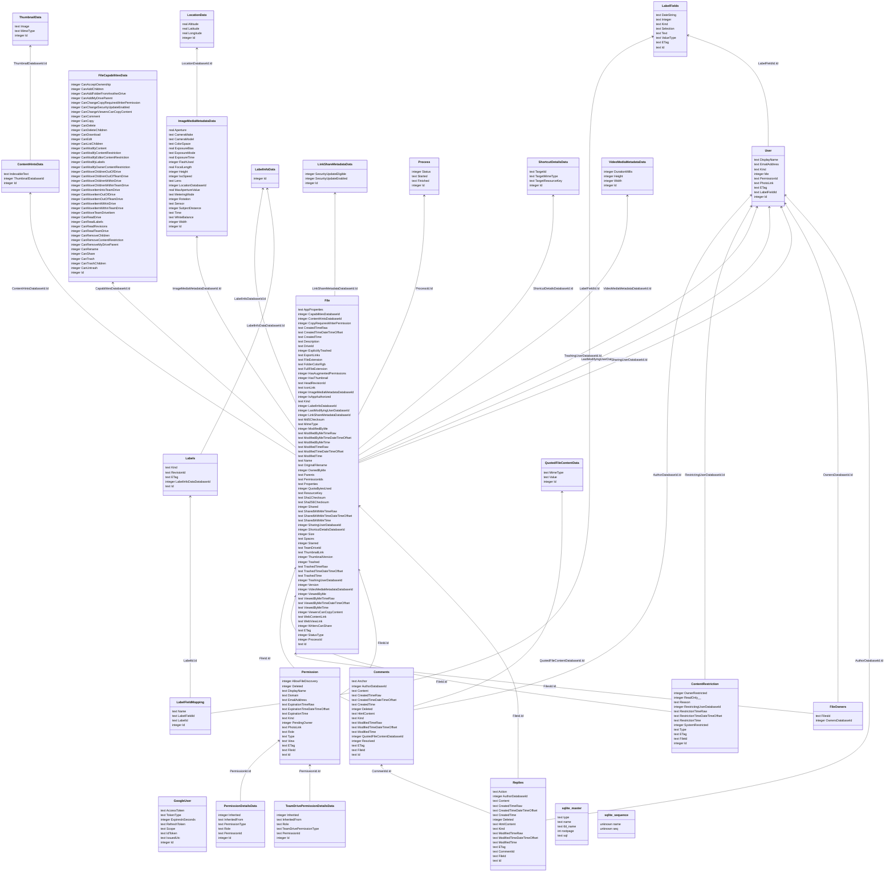

# About

This project lets you create a backup of all meta data from a google drive, and saves all the properties in a sqlite database.

This can be used to easier search through your files, file history, file changes, comments and replies.

# Getting Started

## Creating project and credentials in Google.

This part describes how to create a project and credentials in [[Google]].
Note: It doesn't really matter in which account you create these credentials. Some corporate google accounts have disabled creating projects and API based client credentials. But you can just create a project from your personal google account, and then later login from your corporate google account into this project.

Create a new Google Project:
https://console.cloud.google.com/projectcreate

Enable the Google Drive API:
https://console.cloud.google.com/apis/api/drive.googleapis.com

Create credentials for the API:
https://console.cloud.google.com/apis/credentials/wizard?api=drive.googleapis.com

Download credentials as Json. Should look something like:

``` json
{
  "installed": {
    "client_id": "xxxxx.apps.googleusercontent.com",
    "project_id": "xxxxx",
    "auth_uri": "https://accounts.google.com/o/oauth2/auth",
    "token_uri": "https://oauth2.googleapis.com/token",
    "auth_provider_x509_cert_url": "https://www.googleapis.com/oauth2/v1/certs",
    "client_secret": "xxxx",
    "redirect_uris": [
      "http://localhost"
    ]
  }
}
```

Save the project credentials as Credentials.json in the project folder

In the [[OAuth]] consent screen:
https://console.cloud.google.com/apis/credentials/consent

- Add the users that you want to use this project on as test users
- OR - actually publish the project so that everyone can use it.
	- But then your project might have to go through the google review, depending on the permissions you're trying to use.
	- So just using this as a Test Project is easier.

## First Time Running
Before starting, there's another config file: `appsettings.json` containing a field called `AccountToUse` - fill in the account you intent to use this tool on.

The purpose is that all accounts a separated in their own [[sqlite]] database. So the program needs to know where to store the results

The first time you will run this application, a new browser will open and prompt you to login with google credentials. These credentials will be saved in that sqlite database.

# Running more often
The program only loads changes since the last known modifications. So you can configure this program to run every time your computer starts, or put it in some kind of task scheduler.

You can call the program with command args `silent` and the program won't wait for console input to finish.
- The console will then also attempt to hide itself (the console window) - So it doesn't popup and show
	- This might not work on all systems or new terminals

# QA:
- Q: Hey this is kind of slow, why are you processing everything sequentially?
	- A1: Because [[Google]]/[[Google Drive]] has rate limits, so there's not much optimization to be done. 
		- If I make it faster, I'll get rate-limited.
		- And then I'll have to make it slower again, and balance the speed to respect the google rate limit
	- A2: Also [[sqlite]] is not great at multithreaded inputs
		- So I'd first have to do the calls, cache them in memory, and then later batch insert them
		- If the process stops in the middle of a batch, that data would be lost.
		- So it's just more convenient to do that sequentially as well.

- Q: Why are you using the Google Drive API from source, instead of using the package?
	- A: I copied the Google Drive API from source: https://github.com/googleapis/google-api-dotnet-client/blob/main/Src/Generated/Google.Apis.Drive.v3/Google.Apis.Drive.v3.cs
		- Because if I used the package, I'd have to create entities for all Google Drive DTOs, 
		- And I'd have to create a mapper between the Google Drive DTOs and database entities.
		- I tried just adding the file as a partial git-module, but git-moduling the repo crashes in the middle
		- Yea, it's bit hacky to dump DTOs straight into a database, but it's a lot faster to build, and less bloaty mapper

- Q: How can I view the result?
	- A: You need to install a sqlite viewer, 
		- Personally I prefer [[DataGrip]] - but that's not free
		- There are free alternatives
	- A2: [[Eventually™]] I might make an exporter to markdown 


- Q: What data is stored locally?
	- A: As much as possible! Here's an overview over everything saved: Probably best rendered in [[Obsidian]] if [[Github]] is not displaying the diagram correctly



